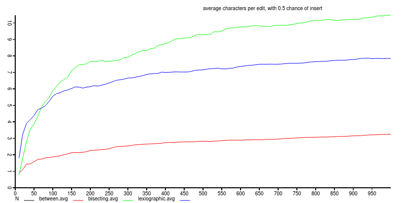
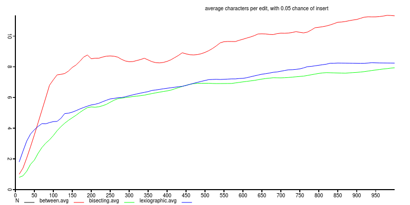
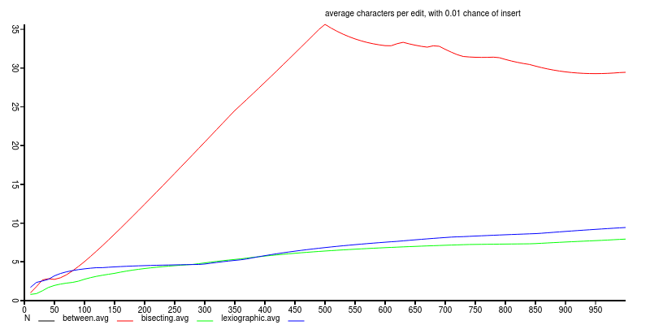

# between-experiment

perform experiments to evaluate the performance of CRDT editing
librarys.

## experiment

simulate the editing of a text, perform N edits to an array.
normally, inserting another token immediately after the preceding
token, but jumping to another position with probabilty J.

[between](https://github.com/dominictarr/between)
and [bisecting-between](https://github.com/noffle/bisecting-between)
are compared.

## results

`between` performs better when there is a high probability of an insert

With 10% jumps, the better algorithm becomes bisecting.
Running this test multiple times sometimes produces a different result.

after the chance of jump gets lower, `bisecting-between` becomes clearly more efficient.

## future work

when J=0.1 running the test does not always produce the same winner.
Luck may play a role early in the setup, depending if there are a lot
of appends or not early in the experiment.

Maybe rerun the experiments with deterministic randoness so that
the algorithms can be compared across the same set of edits.

run each model a bunch of times and graph avg + standard deviation

## License

MIT

