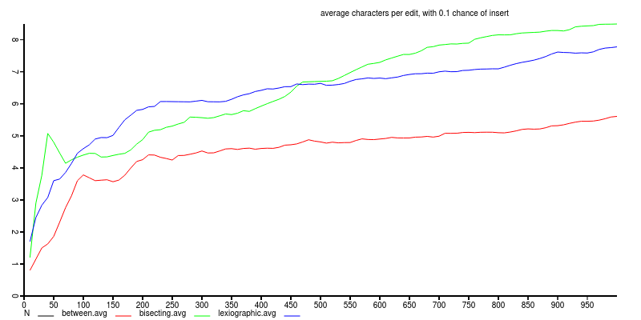

# between-experiment

perform experiments to evaluate the performance of CRDT editing
librarys.

## experiment

simulate the editing of a text, perform N edits to an array.
normally, inserting another token immediately after the preceding
token, but jumping to another position with probabilty J.

[between](https://github.com/dominictarr/between)
and [bisecting-between](https://github.com/noffle/bisecting-between)
are compared.

## results

`between` performs better when there is a high probability of an insert

with even a 10% chance of jump, `between` is still better.

after the chance of jump gets lower, `bisecting-between` becomes clearly more efficient.

## License

MIT

